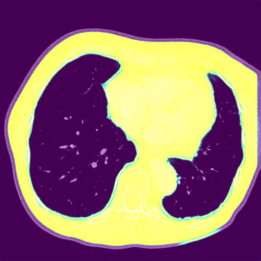

## Biblioteka iNNvestigate

W bibliotece iNNvestigate było dostępnych wiele metod jednak tylko część z nich mogłabyć zastosowana do objaśnienia naszej sieci.

### 1.1 LRPEpsilon
Najciekawsze wyniki, uzyskaliśmy przy pomocy metody LRPEpsilon, jednak jak widać na załączonym wykresie trudne jest wyciągnięcie z tego wniosków co do tego jak przebiega uczenie sieci. Metoda ta przypisuje rekurencyjnie istotność każdemu wejściowemu neuronowi proporcjonalnie do jego wpływu na neuron wyjściowy.

Możemy zauważyć, że z powodu MaxPoolingu za istotne zostały uznane te neurony, które zostały po ostatnim MaxPoolingu, czyli jest ich około 64 x 64. 

### 1.2 DeepTaylor
Kolejną metodą, którą udało się zastosować na naszym modelu jest DeepTaylor. Niestety w przypadku tej metody wyniki były jeszcze mniej zrozumiałe niż w poprzedniej.
Działanie tej metody polega na obliczaniu dla każdego neuronu rootpointu, który jest zbliżony do wejścia, ale którego wartość wyjściowa wynosi 0, następnie ta różnica jest wykorzystywana do rekurencyjnego oszacowania istotności każdego neuronu.

## 2 Skorzystanie z innych frameworków

### 2.1 tf_explain

Zdecydowaliśmy się na skorzystanie z biblioteki [tf_explain](https://github.com/sicara/tf-explain). Udostępnia ona kilka metod XAI, które nie są dostępne w poprzednich frameworkach. Niestety nie wszystkie z nich nadają się do wyjaśniania problemu segmentacji. Do naszego problemu można użyć co najmniej dwóch metod udostępnianych w tym pakiecie.

Pierwszą z nich autorzy nazwali GradCAM. Metoda opiera się na analizie gradientów w warstwach aktywacyjnych. Na danych z naszego modelu prezentuje się to następująco: 

Jak widać model zwraca uwagę na wszystkie tkanki poza wewnątrz ciała człowieka. Ignoruje natomiast obszar poza nim. Większą uwagę poświęca też granicom między płucami a innymi częściami ciała.

Drugą metodą z tego pakietu, którą zastosowaliśmy jest Occlusion Sensitivity. Metoda ta polega na iteracyjnym przesłanianiu poszczególnych części obrazka wejściowego i sprawdzania wpływu tego przesłonięcia na wynik. Dla innego obrazka z naszych danych wyjaśnienie wygląda tak:

Jak widać, wyniki tej metody również wskazują na poprawne działanie modelu.
