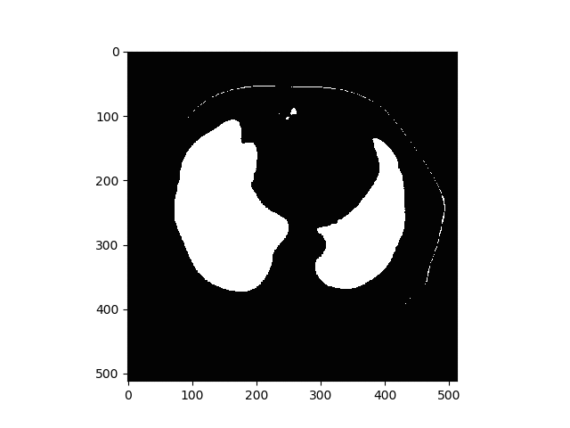
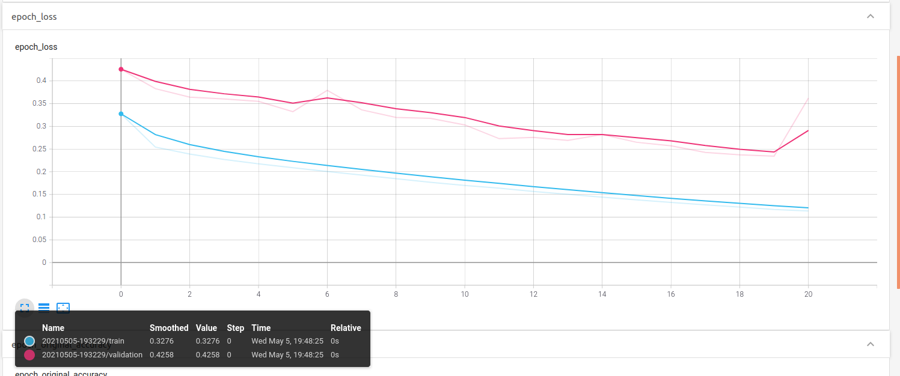

# Praca domowa nr 7 - Zaawansowane techniki

## 1. Monitorowanie uczenia modeli

### 1.2 Wywołania zwrotne - callbacks

Pakiet Keras udostępnia swoim użytkownikom szereg wywołan zwrotnych wykorzystywanych w procesie trenowania modeli. Istnieje możliwość dodania tzw. callbacków uaktywnianych w różnych etapach trenowania - na początku, na końcu, przed lub po epoce bądź przed lub po prezentacji batcha wzorców. Nietrudno także stworzyć personalizowane wywołanie zwrotne. Co ciekawe, twórcy sieci BCDU-Net aktywnie korzystają z wywołań zwrotnych w swoim rozwiązaniu. Są to:
- ModelCheckpoint - wywołanie zapisujące wagi w sieci, w tym przypadku za każdym razem gdy wartość funkcji straty na zbiorze walidacyjnym jest dotychczas najniższa,
- ReduceLROnPlateau - wywołanie służące dynamicznym modyfikacjom współczynnika uczenia, w tym przypadku w momencie gdy wartość funkcji straty nie maleje przez 7 kolejnych epok.

Ze względu na przydatność w procesie trenowania, zdecydowaliśmy się na dodanie kilku nowych wywołań zwrotnych:
- TensorBoard - zapisuje logi istotne w kontekście wizualizacji modelu w narzędziu o tej samej nazwie,
- CSVLogger, który zapisuje wartości funkcji straty oraz metryk na zbiorach treningowych i walidacyjncyh po kolejnych epokach,
- TerminateOnNaN, który kończy uczenie gdy wartość funkcji straty jest niezdefiniowana

oraz własnoręcznie napisane wywołanie zwrotne o nazwie PredictImage, które po każdej kolejnej epoce zapisuje maskę predykowaną przez sieć w bieżącym stanie dla wybranej obserwacji, najlepiej z zbioru testowego. Takie wywołanie zwrotne może generować ciekawe animacji prezentujące poprawę skuteczności modelu w kolejnych iteracjach.

W generowanych w przyszłości grafikach pojawi się informacja na temat epoki, po której powstała dana maska.

### 1.3 Tensorboard

Dzięki skorzystaniu z wywołania zwrotnego TensorBoard istnieje możliwość monitorowania procesu trenowania sieci, zarówno na bieżąco, jak i po fakcie. Aplikacja TensorBoard udostępnia interfejs umożliwiający m.in. śledzenie modyfikacji parametrów sieci, wartości funkcji straty oraz metryk i wyświetlania diagramów reprezentujących sieć. Diagram dla sieci rozwiązującej również zadanie dodatkowe z PD5 prezentuje się następująco:

Dzięki śledzeniu wartości funkcji celu można zidentyfikować kiedy model zaczyna się nadmiernie dopasowywać do danych, tracąc możliwość generalizacji. W poniższym przypadku niepokojąco wygląda wartość funkcji straty na zbiorze walidacyjnym po 20 epokach, która zaczyna rosnąć.

